- [1. Introduction](#1-introduction)
  - [1.1. Nice-to-know / Download-Links](#11-nice-to-know--download-links)
  - [1.2. Learning Goals](#12-learning-goals)
- [2. Database](#2-database)
  - [2.1. Install XAMPP](#21-install-xampp)
    - [2.1.1 Install via Wizard](#211-install-via-wizard)
    - [2.1.2. Install XAMPP via docker image](#212-install-xampp-via-docker-image)
      - [Install Docker and set up the  XAMPP container in Ubuntu](#install-docker-and-set-up-the--xampp-container-in-ubuntu)
      - [Install Docker and set up the container in Windows](#install-docker-and-set-up-the-container-in-windows)
      - [Manage the Docker container](#manage-the-docker-container)
  - [2.2. Setup user, database and permission](#22-setup-user-database-and-permission)
- [3. Server](#3-server)
  - [3.1. Preparation](#31-preparation)
    - [3.1.2 Select a workspace](#312-select-a-workspace)
    - [3.1.3. Create a new maven project](#313-create-a-new-maven-project)
    - [3.1.4. Include needed java libraries](#314-include-needed-java-libraries)
    - [3.1.5. Prepare the spring boot server application](#315-prepare-the-spring-boot-server-application)
    - [3.1.6. Make the application runnable](#316-make-the-application-runnable)
  - [3.2. Server implementation](#32-server-implementation)
    - [3.2.1. Create package structure](#321-create-package-structure)
    - [3.2.2. Entities](#322-entities)
      - [3.2.2.1. AbstractEntity.java](#3221-abstractentityjava)
      - [3.2.2.2 Person.java](#3222-personjava)
    - [3.2.3. Repositories](#323-repositories)
      - [3.2.3.1. GenericRepository.java](#3231-genericrepositoryjava)
      - [3.2.3.2. PersonRepository.java](#3232-personrepositoryjava)
    - [3.2.4. Restcontroller](#324-restcontroller)
      - [3.2.4.1. GenericRestController.java](#3241-genericrestcontrollerjava)
      - [3.2.4.2. PersonRestController.java](#3242-personrestcontrollerjava)
  - [3.3. Testing the server](#33-testing-the-server)
    - [Example testing with Rested for Firefox](#example-testing-with-rested-for-firefox)
- [4. Client](#4-client)
  - [4.1. Preparation](#41-preparation)
    - [4.1.2. Create maven project with archetype](#412-create-maven-project-with-archetype)
    - [4.1.3. Delete unwanted files](#413-delete-unwanted-files)
    - [4.1.4. Customize pom.xml](#414-customize-pomxml)
  - [4.2 Implementation](#42-implementation)
    - [4.2.1. Create package structure](#421-create-package-structure)
    - [4.2.2. Configure module-info.java](#422-configure-module-infojava)
    - [4.2.3. Create App class](#423-create-app-class)
    - [4.2.4. Finalize the app class](#424-finalize-the-app-class)
    - [4.2.5. Create the FXML file PersonView.fxml for the UI hierarchy](#425-create-the-fxml-file-personviewfxml-for-the-ui-hierarchy)
    - [4.2.6. First App test](#426-first-app-test)
    - [4.2.7. Model classes](#427-model-classes)
      - [4.2.7.1 AbstractModel.java](#4271-abstractmodeljava)
      - [4.2.7.2. Person.java](#4272-personjava)
    - [4.2.8. Service classes](#428-service-classes)
      - [4.2.8.1. GenericRestService.java](#4281-genericrestservicejava)
      - [4.2.8.2. PersonRestService.java](#4282-personrestservicejava)
    - [4.2.9. The controller class](#429-the-controller-class)
    - [4.2.10. Service properties](#4210-service-properties)
    - [4.2.11. Person view class](#4211-person-view-class)
    - [4.2.12. Set controller in fxml view](#4212-set-controller-in-fxml-view)
    - [4.2.13. Fill up the view](#4213-fill-up-the-view)
    - [4.2.14. DO NOT FORGET: Final module-info.java version](#4214-do-not-forget-final-module-infojava-version)
- [5. Full stack test](#5-full-stack-test)


# 1. Introduction

In this internship we will build a JavaFX client app which can create the most simplest form of users/persons with only one attribute (name) and sends them to a java server via HTTP. The server will digest those requests by either storing or getting the data in/from a mariadb database.

We use Java, Maven, Spring Boot, and XAMPP for this. 

We use the Java development environment Eclipse, but thanks to the modularity of
Maven projects any other Java development environment could also be used
like Intellij IDEA, NetBeans or Visual Studio Code Java. However we will use Eclipse + Maven here!

So please make sure you have a Java 11 Development Kit, Eclipse (which **already** includes Maven, unlike VsCode) and Gluon Scene Builder installed **before you read further than this section 1!**

*If you need help in setting up your development environment please read the [software engineering 1 Java & Eclipse tutorial](https://github.com/hs-duesseldorf/software-engineering-1)*

**The whole source code will be provided! Make sure you correctly copy & paste - especially the `module-info.java` at the end!**

## 1.1. Nice-to-know / Download-Links

- [(AdoptOpenJDK) Java Development Kit](https://adoptopenjdk.net/)
- [Eclipse](https://www.eclipse.org/downloads/) or [Visual Studio Code Java](https://code.visualstudio.com/docs/languages/java)
- [Gluon Scene Builder](https://gluonhq.com/products/scene-builder)
- [Annotationen](https://de.wikipedia.org/wiki/Annotation_(Java))
- [Generics](https://de.wikipedia.org/wiki/Generische_Programmierung_in_Java)
- [Maven](https://de.wikipedia.org/wiki/Apache_Maven)
- [Spring Boot](https://spring.io/projects/spring-boot)
- [HTTP](https://de.wikipedia.org/wiki/Hypertext_Transfer_Protocol) und [REST](https://de.wikipedia.org/wiki/Representational_State_Transfer)
- [JavaFX](https://openjfx.io/)
- [Java Moduls](https://openjdk.java.net/projects/jigsaw/quick-start)
- [Singletons](https://de.wikibooks.org/wiki/Muster:_Java:_Singleton)

## 1.2. Learning Goals

- Use Maven to access external java libraries
- Use abstract classes, abstract methods and generics to reduce code duplication
- Get to know spring boot
- Learn REST and most HTTP calls
- Learn the basics of Java FX and Scene Builder

# 2. Database

## 2.1. Install XAMPP

XAMPP can be used to simplify the process of setting up a database, user and permissions. If you are familiar with mariadb/mysql you may not want to use XAMPP at all.
XAMPP contains a mysql database, an apache server and PHP to control your database from within your browser with phpmyadmin.

You can install XAMPP with __either__ an installation wizard for Windows/MacOS/Linux __or__ via a docker image.

### 2.1.1 Install via Wizard

- Download the [installation wizard](https://www.apachefriends.org/de/download.html) for your operating system
- Linux users need to make the installer runnable with (version number may change...)
    ```bash
    cd ~/Downloads
    chmod +x xampp-linux-x64-7.4.7-0-installer.run
    sudo ./xampp-linux-x64-7.4.7-0-installer.run
    ```
- Click through the wizard to install XAMPP and start it

### 2.1.2. Install XAMPP via docker image

A very comfortable way of setting up a XAMPP installation is via a docker container. In Ubuntu the installation of Docker is very simple, in Windows you need to have either Windows 10 Enterprise, Pro or Education installed, Windows Home is not enough. If you do so, you can install Docker via this official Docker Tutorial: https://docs.docker.com/docker-for-windows/install/

#### Install Docker and set up the  XAMPP container in Ubuntu

- Open a terminal with CTRL + ALT + T and insert the following commands successively :
    ```bash
    sudo apt install docker.io
    sudo groupadd docker
    sudo usermod -aG docker $USER
    reboot # this restarts your machine
    docker pull cswl/xampp # start a new terminal
    ```
- Create a new bash shell script named `xampp-docker.sh` in your ```~/Downloads``` directory:

    ```bash
    IMAGE_NAME=cswl/xampp
    CONTAINER_NAME=xamppy-docker
    PUBLIC_WWW_DIR='~/web_pages'


    echo "Running container '$CONTAINER_NAME' from image '$IMAGE_NAME'..."

    docker start $CONTAINER_NAME > /dev/null 2> /dev/null || {
        echo "Creating new container..."
        docker run \
                -e TZ=Europe/Berlin \
            --detach \
            --tty \
            -p 80:80 \
            -p 3306:3306 \
            --name $CONTAINER_NAME \
            --mount "source=$CONTAINER_NAME-vol,destination=/opt/lampp/var/mysql/" \
                $IMAGE_NAME
    }

    if [ "$#" -eq  "0" ]; then
        docker exec --interactive --tty $CONTAINER_NAME bash
    elif [ "$1" = "stop" ]; then
        docker stop $CONTAINER_NAME
    else
        docker exec $CONTAINER_NAME $@
    fi
    ```
 
- Open the terminal and run the following commands successively to make this *docker-convenience-startup-script* runnable and finally to run, which starts a new docker container, containing the XAMPP instance
    ```bash
    cd ~/Downloads
    chmod +x xampp-docker.sh
    ./xampp-docker.sh
    ```
- If you do not plan to use an IDE (vscode + docker extension for example) to control the docker container, you can stop the container with:
    ```bash
    ./xampp-docker.sh stop
    ```

#### Install Docker and set up the container in Windows

- Open up Docker Desktop or a command shell and run the following command:
    ```
    docker run -e TZ=Europe/Berlin --detach --tty -p 8086:80 -p 3306:3306 --name xamppy-docker --mount "source=xamppy-docker-vol,destination=/opt/lampp/var/mysql/" cswl/xampp
    ```

#### Manage the Docker container

You can either user Docker Desktop for managing your docker container (start, stop, etc) if you use Windows or you can use [the official Microsoft Docker extension for vscode](https://marketplace.visualstudio.com/items?itemName=ms-azuretools.vscode-docker) (recommended if you use Ubuntu).

## 2.2. Setup user, database and permission

If you used either the XAMPP installer or the docker container to set up XAMPP you can now proceed to set up your database, its user and permissions:

- navigate to http://localhost:80/phpmyadmin
- click on "User accounts"
- click on "Add user account"
- insert a user name and password
- **IMPORTANT**: check "Create database with same name and grant all privileges." and "Grant all privileges on wildcard name (username\_%)." and "Check all"
- don't change anything else
- click "Go"

# 3. Server

## 3.1. Preparation

Eclipse differentiates between the directory in which it has its workspace
and the directories in which the projects are located.
I.e. the workspace can be in a different directory than the projects
(Maven projects, Gradle projects, simple Eclipse Java projects) -
everything could also be in a directory. In other IDEs
(Integrated Development Environment) the workspace does not necessarily have to be selected
 (Visual Studio Code).

### 3.1.2 Select a workspace

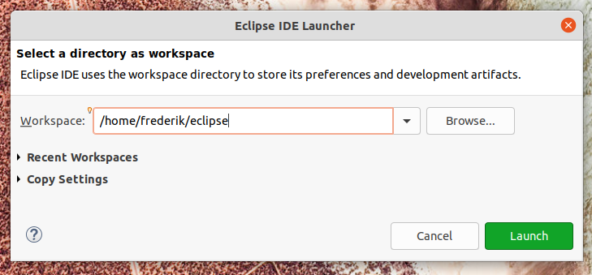

### 3.1.3. Create a new maven project


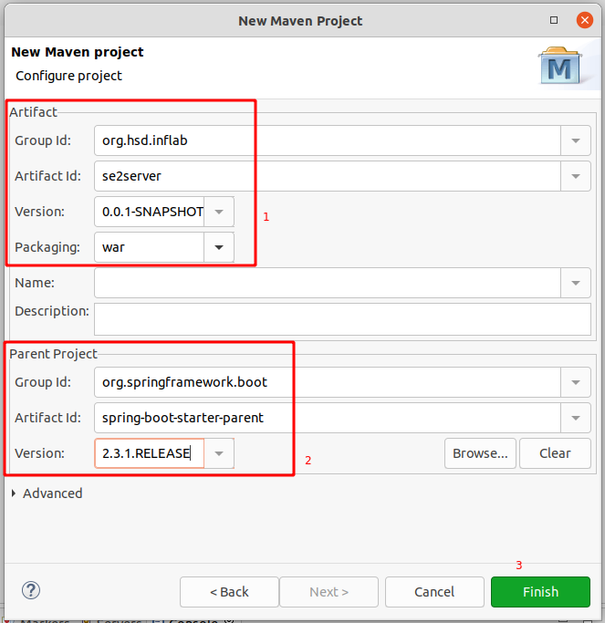

VsCode users: press ```CTRL + SHIFT + P``` and type ```Maven: Create Maven Project``` and follow the wizard in the terminal or create a Maven project with the "+" Symbol in the Java Projects section in your sidebar


### 3.1.4. Include needed java libraries


Open ```pom.xml``` and insert the following XML snippet under ```<packaging>war</packaging>``` and above ```</project>```:
```xml
<dependencies>
    <dependency>
        <groupId>org.springframework.boot</groupId>
        <artifactId>spring-boot-starter-data-jpa</artifactId>
    </dependency>
    <dependency>
        <groupId>org.springframework.boot</groupId>
        <artifactId>spring-boot-starter-data-rest</artifactId>
    </dependency>
    <dependency>
        <groupId>mysql</groupId>
        <artifactId>mysql-connector-java</artifactId>
        <scope>runtime</scope>
    </dependency>
</dependencies>
```

### 3.1.5. Prepare the spring boot server application

Create the package ```org.hsd.inflab.se2server```


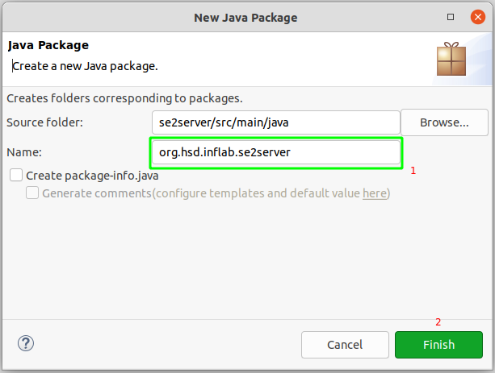

Create the class ```Application.java``` inside the package you've just created:


Name it Application and click to insert main method:


### 3.1.6. Make the application runnable

- Open ```Application.java```
- Insert ```@SpringBootApplication``` above ```public class Application```
- Insert ```SpringApplication.run(Application.class, args);``` inside the main() method to run the application
- Import missing dependencies with CTRL + SHIFT + O (ALT + SHIFT + O in vscode)
- Save the file (CTRL + S)
- Create the file ```application.properties``` inside the ```src/main/resources``` package and insert the following properties and change DATABASENAME, USERNAME and PASSWORD to the values you've entered in 2.2.:

    ```
    spring.jpa.hibernate.ddl-auto=create-drop
    spring.datasource.url=jdbc:mysql://localhost:3306/DATABASENAME
    spring.jpa.database-platform=org.hibernate.dialect.MySQL5Dialect
    spring.datasource.username=USERNAME
    spring.datasource.password=PASSWORD
    spring.jackson.serialization.fail-on-empty-beans=false
    spring.jpa.show-sql=true
    ```

- Run ```Application.java``` (Eclipse: right click -> Run as -> Java application | VsCode: click on "run" above main()) to make a first test, we will need to restart it later

## 3.2. Server implementation

### 3.2.1. Create package structure

Create inside the meta package ```org.hsd.inflab.se2server``` with


the following packages:

- ```org.hsd.inflab.se2server.entity```
- ```org.hsd.inflab.se2server.repository```
- ```org.hsd.inflab.se2server.restcontroller```

### 3.2.2. Entities

Create ```AbstractEntity.java``` and ```Person.java``` inside the ```entity``` package (depending on your package presentation it might be displayed with its full name ```org.hsd.inflab.se2server.entity```)

#### 3.2.2.1. AbstractEntity.java

```java
package org.hsd.inflab.se2server.entity;

import java.io.Serializable;

import javax.persistence.Column;
import javax.persistence.GeneratedValue;
import javax.persistence.Id;
import javax.persistence.MappedSuperclass;

import com.fasterxml.jackson.annotation.JsonIgnoreType;

@SuppressWarnings("serial")
@MappedSuperclass
@JsonIgnoreType
public abstract class AbstractEntity implements Serializable {

    @Id
    @GeneratedValue
    @Column(unique = true)
    long id;

    public long getId() {
        return id;
    }

    public void setId(long id) {
        this.id = id;
    }
    
}
```

#### 3.2.2.2 Person.java

```java
package org.hsd.inflab.se2server.entity;

import javax.persistence.Entity;

@Entity
public class Person extends AbstractEntity {

    private static final long serialVersionUID = -3421268250084118586L;
    private String name;

    public String getName() {
        return name;
    }

    public void setName(String name) {
        this.name = name;
    }

    public Person() {
    }
    
}
```

### 3.2.3. Repositories

Create the interfaces (not classes) ```GenericRepository.java``` and ```PersonRepository.java``` inside the ```repository``` package. The person repository works as our data access object (DAO) you might know from other stacks. Depending on your future projects, it might make sense to move away from the generic approach here and just create one repository interface for each entity.

#### 3.2.3.1. GenericRepository.java

```java
package org.hsd.inflab.se2server.repository;

import java.io.Serializable;
import org.hsd.inflab.se2server.entity.AbstractEntity;
import org.springframework.data.jpa.repository.JpaRepository;

public abstract interface GenericRepository<T extends AbstractEntity> extends JpaRepository<T, Serializable> { }
```

#### 3.2.3.2. PersonRepository.java

```java
package org.hsd.inflab.se2server.repository;

import org.hsd.inflab.se2server.entity.Person;

public interface PersonRepository extends GenericRepository<Person> { }    
```

### 3.2.4. Restcontroller

The restcontroller(s) define(s) how the server answers to http calls from clients. Each HTTP command (GET, POST, PUT, DELETE) is translated to a CRUD (create, read/receive, update, delete) operation to store the received JSON in the database as a table row, or to retrieve information the client(s) ask(s) for from the database and send it back inside the http body in JSON.

#### 3.2.4.1. GenericRestController.java

```java
package org.hsd.inflab.se2server.restcontroller;

import java.util.List;
import org.hsd.inflab.se2server.entity.AbstractEntity;
import org.hsd.inflab.se2server.repository.GenericRepository;
import org.springframework.beans.factory.annotation.Autowired;
import org.springframework.web.bind.annotation.DeleteMapping;
import org.springframework.web.bind.annotation.GetMapping;
import org.springframework.web.bind.annotation.PathVariable;
import org.springframework.web.bind.annotation.PostMapping;
import org.springframework.web.bind.annotation.PutMapping;
import org.springframework.web.bind.annotation.RequestBody;

public abstract class GenericRestController<E extends AbstractEntity> {
    
    // We don't know which fields the entities have so
    // the concrete classes need to implement this method
    protected abstract E updateEntity(E e, E newE);
    
    @Autowired
    protected GenericRepository<E> repository;

	@GetMapping // HTTP GET
	public List<E> list() {
        return repository.findAll();
    }
    
	@PostMapping // HTTP POST
	public E create(@RequestBody E entity) {
        return repository.save(entity);
    }
    
	@DeleteMapping("{id}") // HTTP DELETE
	public void delete(@PathVariable(value = "id") long id) {
        repository.deleteById(id);
    }
    
	@GetMapping("{id}") // HTTP GET
	public E get(@PathVariable(value = "id") long id) {
        return repository.getOne(id);
    }
    
    @PutMapping("{id}") // HTTP PUT
    public E update(@PathVariable long id, @RequestBody E newE) {

        return repository.findById(id).map(e -> {
            e = updateEntity(e, newE);

			return repository.save(e);

        }).orElseGet(() -> {
            newE.setId(id);
            return repository.save(newE);
        });        
    }
}
```

#### 3.2.4.2. PersonRestController.java

```java
package org.hsd.inflab.se2server.restcontroller;

import org.hsd.inflab.se2server.entity.Person;
import org.springframework.web.bind.annotation.RequestMapping;
import org.springframework.web.bind.annotation.RestController;

@RestController
// the url suffix where the person resource
// is mapped to
@RequestMapping("/persons")
public class PersonRestController extends GenericRestController<Person> {

    // Our concrete entity person has only one field
    // So this might look a bit over engineered
    @Override
    protected Person updateEntity(Person e, Person newE) {
        e.setName(newE.getName());

        return e;
    }    
    
}
```

## 3.3. Testing the server

You could now test the server with any rest client. For example:

- ["Rested" addon for firefox](https://addons.mozilla.org/de/firefox/addon/rested/)
- ["Advanced REST client" extension for chrome/edge](https://chrome.google.com/webstore/detail/advanced-rest-client/hgmloofddffdnphfgcellkdfbfbjeloo?hl=de)
- the CLI program [curl](https://curl.haxx.se/) (ubuntu: `sudo apt install curl`)
- [REST client vscode extension](https://marketplace.visualstudio.com/items?itemName=humao.rest-client)
- [Postman](https://www.postman.com)
- [Insomia](https://insomnia.rest)

### Example testing with Rested for Firefox

As described you can use any of common rest client test apps around.
We will use Rested for Firefox here:

- open up the rested firefox extension
- send a HTTP GET to localhost:8080/persons
    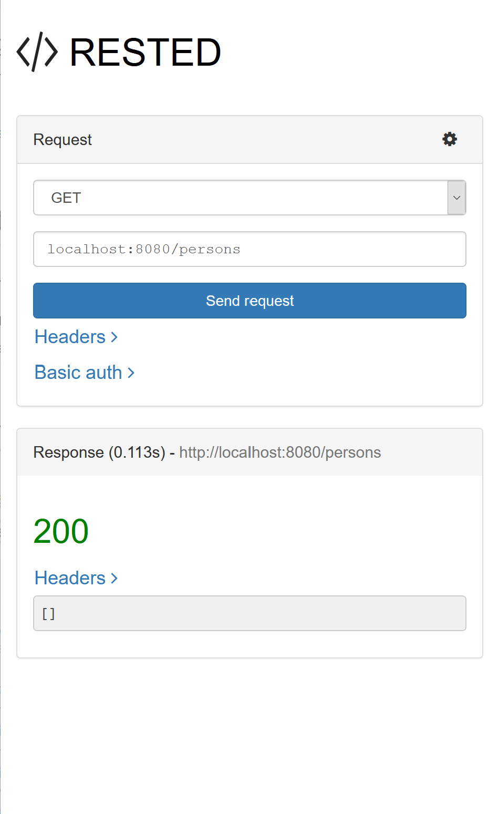
- currently the person list is empty so we receive an empty JSON array
- send a HTTP POST to localhost:8080/persons with a body, select the HTTP method POST from the dropdown menu and insert the property `name` with any value you like
    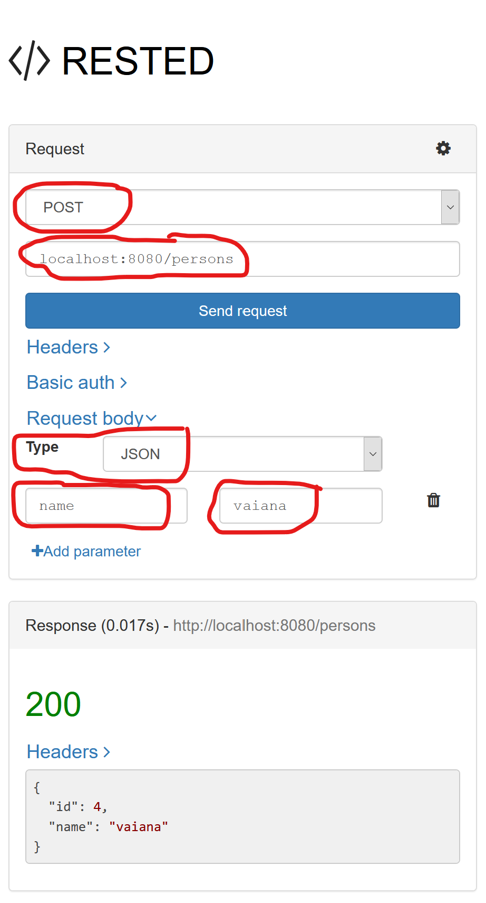
- remember the value of the `id` property the rest server has (here it is 4) send back to you for the created user and send a HTTP DELETE request to the url localhost:8080/persons/4
    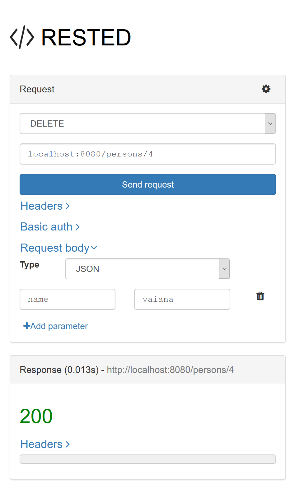

# 4. Client

## 4.1. Preparation

### 4.1.2. Create maven project with archetype

This time we create the maven project from an archetype. Normally this saves time if you know which dependencies/libraries you want to include, before you start.

Right click on a free spot inside the package explorer and create a new maven project with with *New -> Other -> Search for "Maven" -> Maven project*


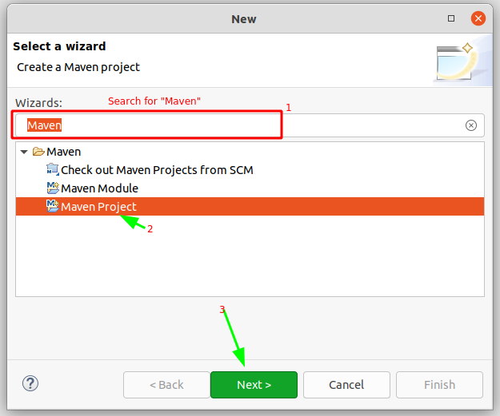

This time do NOT check the box for 


Search for *javafx* inside the filter textfield and select the row with *org.openjfx javafx-archetype-fxml*

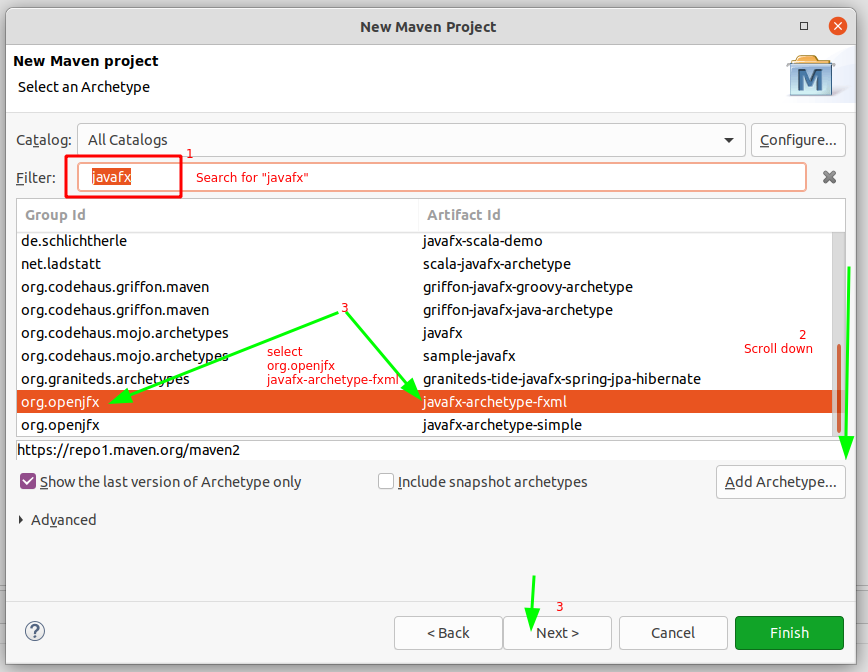

Now insert again the groupId ```org.hsd.inflab``` but the artifactId ```se2fxclient```- the package needs to be named ```org.hsd.inflab.se2fxclient```

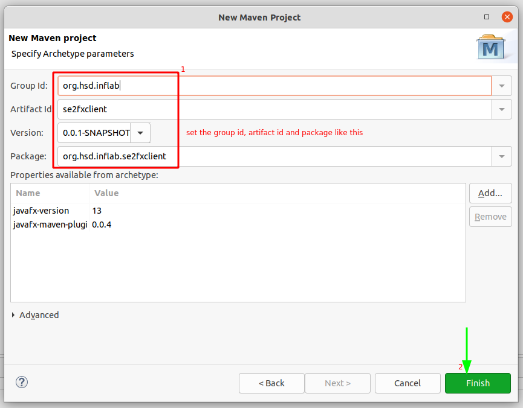

### 4.1.3. Delete unwanted files

The archetype created the ```pom.xml```, the outer package structure and ```module-info.java``` for us.
But it also created some files which we do not need. Thus we need to delete them now, to prevent confusion.

**Delete:**

... in ```src/main/java/org/hsd/inflab/se2```

- App.java
- PrimaryController.java
- SecondaryController.java

... in ```src/main/resources/org/hsd/inflab/se2```

- primary.fxml
- secondary.fxml

We will create similar files by hand in the next steps.

### 4.1.4. Customize pom.xml

Even though we've created the maven project from the archetype, we still need to add two dependencies (external java libraries) for creating a HTTPClient and JSONObjects into ```pom.xml```. Inside ```<depedencies>...</dependencies>``` add the following lines (depending on the time you read this tutorial, you might need to adapt the version numbers...):

```xml
<dependency>
    <groupId>org.apache.httpcomponents</groupId>
    <artifactId>httpclient</artifactId>
    <version>4.5.9</version>
</dependency>
<dependency>
    <groupId>org.json</groupId>
    <artifactId>json</artifactId>
    <version>20190722</version>
</dependency>
```
**Information**: we use the apache HttpClient, because it allows us to create a CloseableHttpClient, which is closed automatically in a try-with-resource statement. This is currently not possible with the HttpClient in the JDK, so we would need to close the HttpClient ourselves!

## 4.2 Implementation

### 4.2.1. Create package structure

Inside ```src/main/java``` create the following packages successively

- ```org.hsd.inflab.se2fxclient.model```
- ```org.hsd.inflab.se2fxclient.view```
- ```org.hsd.inflab.se2fxclient.controller```
- ```org.hsd.inflab.se2fxclient.service```

via


and the **FOLDER** named ```view``` and ```service``` inside the ```src/main/resources``` package:

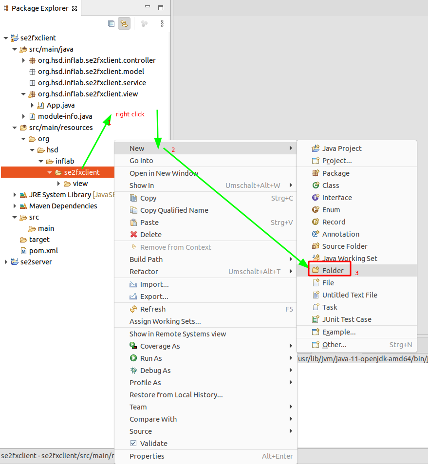


So you end up with:

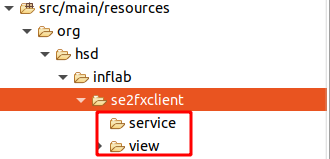

### 4.2.2. Configure module-info.java

**IMPORTANT**: since Java9 javafx is not included in the JDK anymore, so we need to use the new module system to make the JavaFX Modules accessible. Let's start with this version of module-info.java but make sure to comment line 6 and 7 for now, because the controller package is currently empty. We will need to adapt module-info.java while we fill the packages:


### 4.2.3. Create App class

Create the class ```App.java``` inside the ```view``` package, check the box at ```public static void main(String[] args)``` and select ```Application``` from the package ```javafx.application``` as superclass:

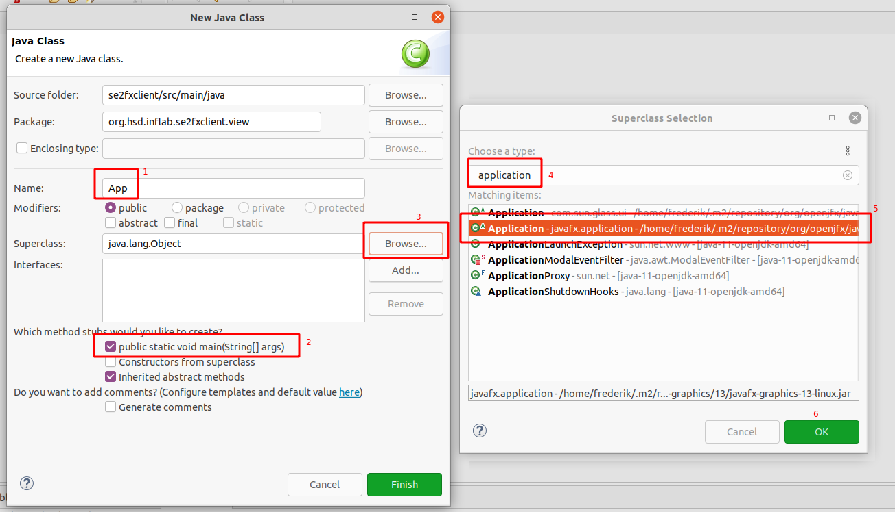

### 4.2.4. Finalize the app class

Put the following code into ```App.java```:

```java
package org.hsd.inflab.se2fxclient.view;

import java.io.IOException;
import javafx.application.Application;
import javafx.fxml.FXMLLoader;
import javafx.scene.Scene;
import javafx.stage.Stage;

public class App extends Application {

    @Override
    public void start(Stage stage) throws IOException {
        FXMLLoader fxmlLoader = new FXMLLoader(App.class.getResource("PersonView.fxml"));
        Scene scene = new Scene(fxmlLoader.load());
        stage.setScene(scene);
        stage.show();
    }

    public static void main(String[] args) {
        launch();
    }
}
```

***IMPORTANT***: ```App.java``` and ```PersonView.fxml``` from the next section  need to be in the same package: ```view```. But the java file inside ```src/main/java/org/hsd/inflab/se2fxclient/view``` and the fxml file inside ```src/main/resources/org/hsd/inflab/se2fxclient/view``` !!! Otherwise the FxmlLoader will not find the fxml file.

### 4.2.5. Create the FXML file PersonView.fxml for the UI hierarchy

Open SceneBuilder and create a new file, drag and drop the container ```BorderPane``` out of the left panel (section ```Containers```) onto the drawing area and save the file afterwards into the directory ```se2fxclient/src/main/resources/org/hsd/inflab/se2fxclient/view``` with the file name `PersonView.fxml`


### 4.2.6. First App test

Switch back to your IDE and start ```App.java``` with ```Righ click -> Run as-->Java Application``` (vscode users: click on ```Run | Debug``` above ```public static void main(String[] args)```)

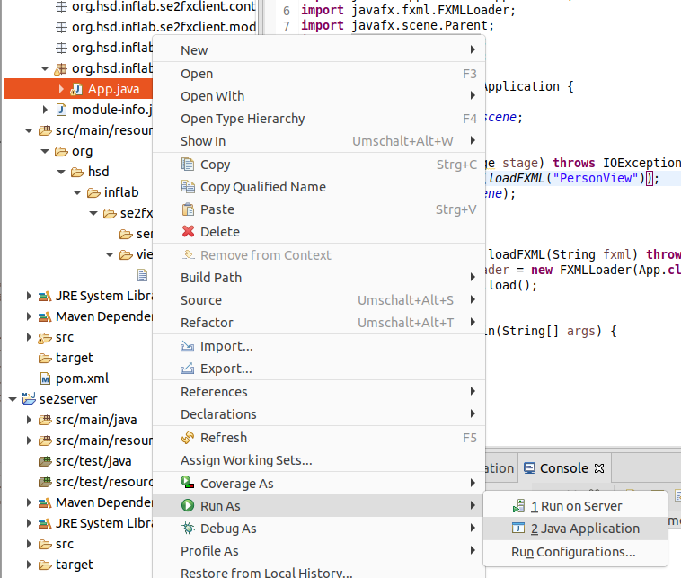

... and a shiny empty white window should appear


### 4.2.7. Model classes

Every person should be availible on each layer. First of all as a simple model class ```Person.java``` inside the client. Create the model classes ```AbstractModel.java``` and ```Person.java``` inside the ```model``` package.

#### 4.2.7.1 AbstractModel.java

```java
package org.hsd.inflab.se2fxclient.model;

public class AbstractModel {
    
    int id;

    public int getId() {
        return id;
    }

    public void setId(int id) {
        this.id = id;
    }
}
```
#### 4.2.7.2. Person.java

```java
package org.hsd.inflab.se2fxclient.model;

public class Person extends AbstractModel {

    String name;

    public String getName() {
        return name;
    }

    public void setName(String name) {
        this.name = name;
    }

    public Person() {
    }

    public Person(String name) {
        this.name = name;
    }    
}
```

### 4.2.8. Service classes

#### 4.2.8.1. GenericRestService.java

The core of the client is the rest service. It contains methods representing the CRUD operations on the server side. create() read() update() and delete() use a HTTPClient to create HTTP calls. They either create JSON Objects from model objects and send them via HTTP, or receive JSON objects from HTTP and return person model objects created from the JSON objects.

To detach most of the code from the actual model object we want to receive, we will first put most of the code inside ```GenericRestController```. Only the specifics like the resource url and how to convert JSON to model and vice versa will be put into ```PersonRestController.java``` which extends ```GenericRestController.java```.
To reduce the amount of HTTPClient objects that are created, we will also use the singleton pattern for the ```PersonRestController.java```.

```java
package org.hsd.inflab.se2fxclient.service;

import java.io.BufferedReader;
import java.io.IOException;
import java.io.InputStreamReader;
import java.util.ArrayList;
import java.util.List;
import java.util.Properties;
import org.apache.http.HttpHeaders;
import org.apache.http.HttpResponse;
import org.apache.http.HttpStatus;
import org.apache.http.client.methods.HttpDelete;
import org.apache.http.client.methods.HttpGet;
import org.apache.http.client.methods.HttpPost;
import org.apache.http.client.methods.HttpPut;
import org.apache.http.entity.StringEntity;
import org.apache.http.impl.client.CloseableHttpClient;
import org.apache.http.impl.client.HttpClientBuilder;
import org.hsd.inflab.se2fxclient.model.AbstractModel;
import org.json.JSONArray;
import org.json.JSONException;
import org.json.JSONObject;

public abstract class GenericRestService<M extends AbstractModel> {
    
    private static String baseUrl;
    private String url;
    protected abstract String getResourceName();
    protected abstract JSONObject createJSONObjectFromModelObject(M m);
    protected abstract M createModelObjectFromJSONObject(JSONObject jsonObject);
    
    protected void createURL() {
        loadProperties();
        url = new String(baseUrl + "/" + getResourceName());
    }

    public GenericRestService() {
        createURL();
    }

    public boolean connectionIsWorking() {
        try (CloseableHttpClient client = HttpClientBuilder.create().build()) {
            HttpGet request = new HttpGet(baseUrl);
            HttpResponse response = client.execute(request);
            return response.getStatusLine().getStatusCode() == HttpStatus.SC_OK;
        } catch (IOException e) {
            e.printStackTrace();
            return false;
        }        
    }

    public static void loadProperties() {
        Properties properties = new Properties();
        try {
            properties.load(GenericRestService.class.getResourceAsStream("connections.properties"));
        } catch (IOException e) {
            e.printStackTrace();
        }
        baseUrl = properties.getProperty("base.url");
    }

    public M create(M m) {
        JSONObject jsonObject = createJSONObjectFromModelObject(m);
        HttpPost request = new HttpPost(url);
        HttpResponse response;
        request.setHeader(HttpHeaders.CONTENT_TYPE, "application/json");

        try (CloseableHttpClient client = HttpClientBuilder.create().build()) {
            request.setEntity(new StringEntity(jsonObject.toString()));
            response = client.execute(request);
            BufferedReader bufferedReader = new BufferedReader(
                    new InputStreamReader(response.getEntity().getContent()));
            StringBuilder stringBuilder = new StringBuilder();
            String line = "";
            while ((line = bufferedReader.readLine()) != null) {
                stringBuilder.append(line);
                System.out.println(line);
            }
            JSONObject personJSON = new JSONObject(stringBuilder.toString());
            m.setId(personJSON.getInt("id"));
        } catch (IOException e) {
            e.printStackTrace();
        }
        return m;
    }

    public List<M> readAll() {
        HttpGet request = new HttpGet(url);
        HttpResponse response;
        List<M> list = new ArrayList<>();
        try (CloseableHttpClient client = HttpClientBuilder.create().build()) {
            response = client.execute(request);
            BufferedReader bufferedReader = new BufferedReader(
                    new InputStreamReader(response.getEntity().getContent()));
            StringBuilder stringBuilder = new StringBuilder();
            String line = "";
            while ((line = bufferedReader.readLine()) != null) {
                stringBuilder.append(line);
            }
            JSONArray jsonArray = new JSONArray(stringBuilder.toString());
            for (JSONObject jsonObject : getJSONObjectListFromJSONArray(jsonArray)) {
                list.add(createModelObjectFromJSONObject(jsonObject));
            }
        } catch (IOException e) {
            e.printStackTrace();
        }
        return list;
    }

    public void update(M m) {
        JSONObject jsonObject = createJSONObjectFromModelObject(m);
        HttpPut request = new HttpPut(url + "/" + m.getId());
        request.setHeader(HttpHeaders.CONTENT_TYPE, "application/json");
        try (CloseableHttpClient client = HttpClientBuilder.create().build()) {
            request.setEntity(new StringEntity(jsonObject.toString()));
            client.execute(request);
            System.out.println(jsonObject.toString());
        } catch (IOException e) {
            e.printStackTrace();
        }
    }

    public void delete(M m) {
        HttpDelete request = new HttpDelete(url + "/" + m.getId());
        request.setHeader(HttpHeaders.CONTENT_TYPE, "application/json");
        try (CloseableHttpClient client = HttpClientBuilder.create().build()) {
            client.execute(request);
            System.out.println("Deleted Entity with id: " + m.getId());
        } catch (IOException e) {
            e.printStackTrace();
        }
    }

    public List<JSONObject> getJSONObjectListFromJSONArray(JSONArray array) throws JSONException {
        ArrayList<JSONObject> jsonObjects = new ArrayList<>();
        for (int i = 0; i < (array != null ? array.length() : 0); jsonObjects.add(array.getJSONObject(i++)))
            ;
        return jsonObjects;
    }
}
```

#### 4.2.8.2. PersonRestService.java

```java
package org.hsd.inflab.se2fxclient.service;

import org.hsd.inflab.se2fxclient.model.Person;
import org.json.JSONObject;

public class PersonRestService extends GenericRestService<Person> {

    // Thread safe singleton pattern
    private static GenericRestService<Person> instance;

    public static synchronized GenericRestService<Person> getInstance() {
        if (instance == null) {
            instance = new PersonRestService();
        }
        return instance;
    }
    
    private PersonRestService() {
        super();
    }

    @Override
    protected String getResourceName() {
        return "persons";
    }

    @Override
    protected JSONObject createJSONObjectFromModelObject(Person m) {
        JSONObject jsonPerson = new JSONObject();
        jsonPerson.put("name", m.getName());
        return jsonPerson;
    }

    @Override
    protected Person createModelObjectFromJSONObject(JSONObject jsonObject) {
        Person person = new Person(jsonObject.getString("name"));
        person.setId(jsonObject.getInt("id"));
        return person;
    }
}
```

### 4.2.9. The controller class

The controller class includes the fxml method ```initialize()``` which is called when the UI is created. Here we set the reference to a new ```PersonRestService``` instance.  We check if the connection is working - if yes we create ```FxPerson``` objects for each person in the database.

```java
package org.hsd.inflab.se2fxclient.controller;

import org.hsd.inflab.se2fxclient.model.Person;
import org.hsd.inflab.se2fxclient.service.GenericRestService;
import org.hsd.inflab.se2fxclient.service.PersonRestService;
import org.hsd.inflab.se2fxclient.view.FxPerson;
import javafx.fxml.FXML;
import javafx.scene.control.Alert;
import javafx.scene.control.Alert.AlertType;
import javafx.scene.layout.VBox;

public class PersonController {

    GenericRestService<Person> personRestService;

    @FXML
    VBox personsVBox;

    @FXML
    private void initialize() {
        personRestService = PersonRestService.getInstance();
        if (personRestService.connectionIsWorking()) {
            for (Person person : personRestService.readAll()) {
                personsVBox.getChildren().add(new FxPerson(person, personsVBox));
            }
        } else {
            new Alert(AlertType.ERROR, "Could not connect to server!").showAndWait();
            System.exit(1);
        }
    }

    public void addNewPerson() {
        Person person = personRestService.create(new Person(""));
        if (person != null) {
            FxPerson fxPerson = new FxPerson(person, personsVBox);
            personsVBox.getChildren().add(fxPerson);
            fxPerson.getName().requestFocus();
        } else {
            new Alert(AlertType.ERROR, "Could not create Person!").showAndWait();
        }
    }
}
```

### 4.2.10. Service properties

Create the file ```connections.properties``` inside the ```service``` package in ```src/main/resources``` and insert 

```
base.url=http://localhost:8080
```

### 4.2.11. Person view class

The UI representation of a person will be put into ```FxPerson.java``` which will be created by the ```PersonController.java``` above.

```java
package org.hsd.inflab.se2fxclient.view;

import org.hsd.inflab.se2fxclient.model.Person;
import org.hsd.inflab.se2fxclient.service.GenericRestService;
import org.hsd.inflab.se2fxclient.service.PersonRestService;
import javafx.scene.control.Button;
import javafx.scene.control.TextField;
import javafx.scene.layout.HBox;
import javafx.scene.layout.VBox;

public class FxPerson extends HBox {

    private TextField name;
    private Button delete, OK;
    private Person person;
    private GenericRestService<Person> personService;

    public FxPerson(Person person, VBox parentVBox) {
        this.person = person;
        personService = PersonRestService.getInstance();
        name = new TextField(this.person.getName());
        delete = new Button("delete");
        delete.setOnAction(e -> {
            personService.delete(person);
            parentVBox.getChildren().removeAll(this);
        });
        OK = new Button("OK");
        OK.setOnAction(e -> {
            person.setName(name.textProperty().getValue());
            personService.update(this.person);
        });
        getChildren().addAll(name, OK, delete);
        applyStyling();
    }

    public TextField getName() {
        return this.name;
    }

    private void applyStyling() {
        name.setStyle("-fx-border-radius: 10 0 0 10");
        name.setStyle("-fx-background-radius: 10 0 0 10");
        name.setMinWidth(300);
        name.setMaxWidth(300);
        delete.setStyle("-fx-border-radius: 0 10 10 0");
        delete.setStyle("-fx-background-radius: 0 10 10 0");
        delete.setMinWidth(100);
        delete.setMaxWidth(100);
        OK.setMinWidth(50);
        OK.setMaxWidth(50);
        OK.setStyle("-fx-border-radius: 0");
        OK.setStyle("-fx-background-radius: 0");
    }
}
```

### 4.2.12. Set controller in fxml view

Open ```PersonView.fxml``` inside SceneBuilder and set ```org.hsd.inflab.se2fxclient.controller.PersonController``` as the ```Controller class```


### 4.2.13. Fill up the view

From within the ```Containers``` in the left panel drag and drop a ```ButtonBar``` into the bottom of the ```BorderPane```

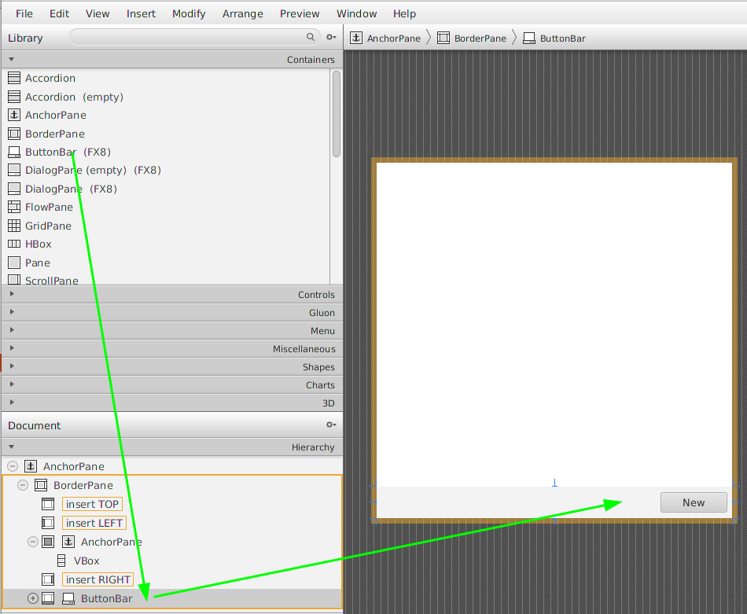

Click on the button and rename it to ```New```


select the button and insert ```addNewPerson``` into the ```On Action``` text field in the ```Code``` section of the right panel to connect the button to method in the controller


Drag and drop an ```AnchorPane``` out of the ```Containers``` section in the left panel into the center of the ```BorderPane```

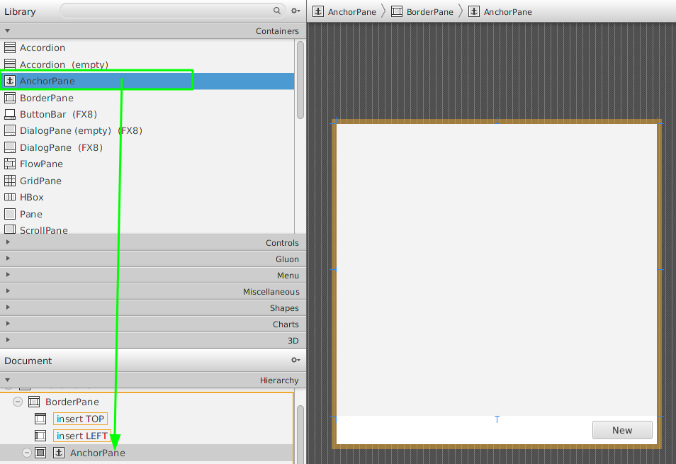

Drag and drop a ```VBox``` out of the ```Containers``` section in the left panel into the ```AnchorPane``` and set the design as you like


Select the VBox and set ```personsVBox``` as the ```fx:id``` in the ```Code``` section of the right panel to connect the variable in your controller class to the fxml

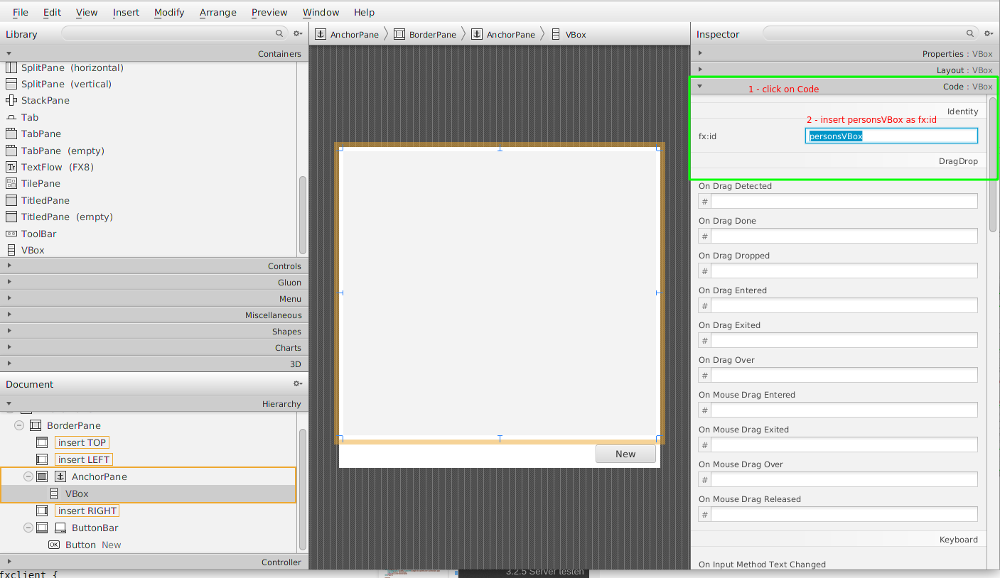

### 4.2.14. DO NOT FORGET: Final module-info.java version

Finally correct ```module-info.java``` to the following, to correctly export and import the packages and modules, otherwise you will not get rid of the many missing imports in various classes:

```java
module org.hsd.inflab.se2fxclient {
    requires transitive javafx.controls;
    requires javafx.fxml;
    requires transitive javafx.graphics;
    requires org.apache.httpcomponents.httpcore;
    requires org.apache.httpcomponents.httpclient;
    // commons.logging This is only important for vscode users
    requires commons.logging;
    requires org.json;

    opens org.hsd.inflab.se2fxclient.view to javafx.fxml;
    opens org.hsd.inflab.se2fxclient.controller to javafx.fxml;
    exports org.hsd.inflab.se2fxclient.controller;
    exports org.hsd.inflab.se2fxclient.view;
    exports org.hsd.inflab.se2fxclient.model;
}
```

# 5. Full stack test

- Start the mysql database from within the XAMPP control panel or the docker container
- Start the server class ```Application.java```
- Start the JavaFx client ```App.java```
- Create a Person
- Rename it and click ```OK``` to submit
- Delete a person with the ```Delete``` button
- Check the database if all changes are correctly committed

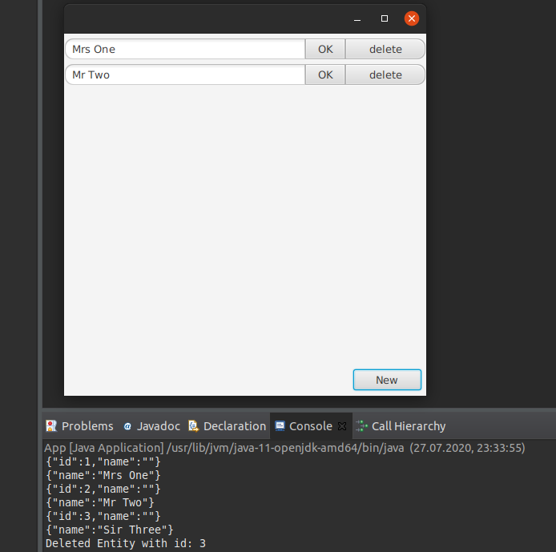
