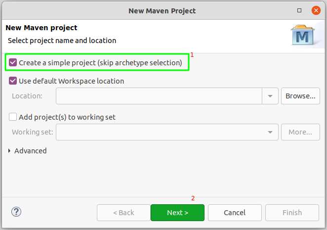
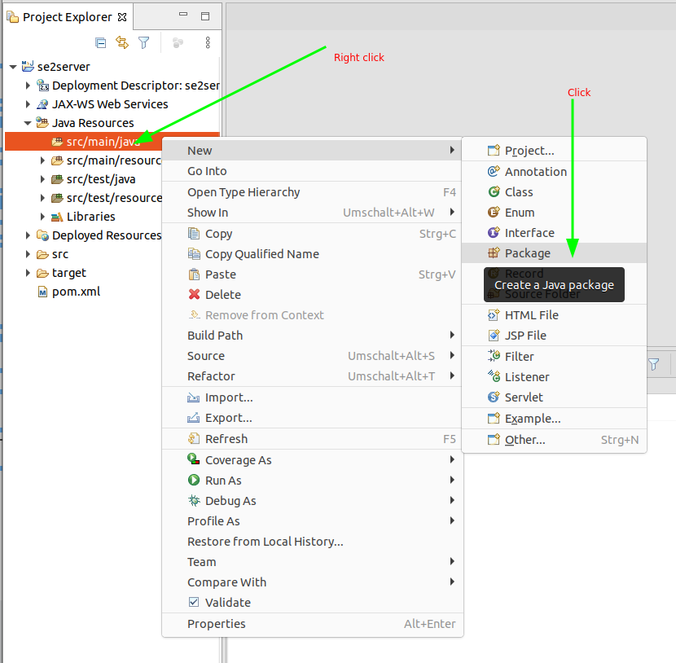
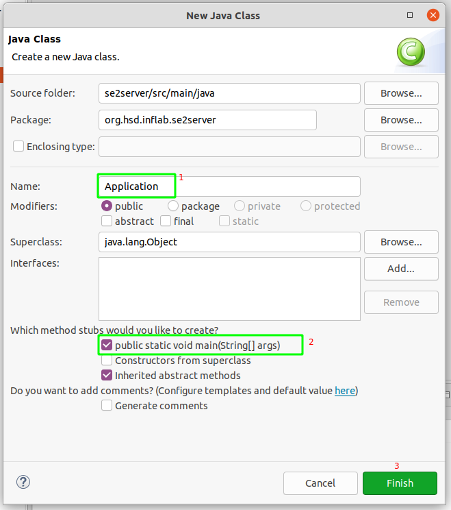

# Introduction

In this internship we will create a javafx client which communicates with a server via http. We use XAMPP, Java, Maven and Spring Boot for this.
The latter is only a means to an end here and should not be discussed further.
We use the Java development environment Eclipse, but thanks to the modularity of
Maven projects any other Java development environment can also be used
like Intellij IDEA, NetBeans or Visual Studio Code Java. And gradle could also be used to include the dependencies and build the project, however this we will use eclipse and maven here.

## Nice-to-know

- [Eclipse](https://de.wikipedia.org/wiki/Eclipse_(IDE)) or [Visual Studio Code Java](https://code.visualstudio.com/docs/languages/java)
- [Gluon Scene Builder](https://gluonhq.com/products/scene-builder)
- [Annotationen](https://de.wikipedia.org/wiki/Annotation_(Java))
- [Generics](https://de.wikipedia.org/wiki/Generische_Programmierung_in_Java)
- [Maven](https://de.wikipedia.org/wiki/Apache_Maven)
- [Spring Boot](https://spring.io/projects/spring-boot)
- [HTTP](https://de.wikipedia.org/wiki/Hypertext_Transfer_Protocol) und [REST](https://de.wikipedia.org/wiki/Representational_State_Transfer)
- [JavaFX](https://openjfx.io/)
- [Java Moduls](https://openjdk.java.net/projects/jigsaw/quick-start)
- [Singletons](https://de.wikibooks.org/wiki/Muster:_Java:_Singleton)

## Idea

JavaFX Client ⟹(HTTP&JSON)⟹ Spring Boot REST JPA Server ⟹ Database

JavaFX Client ⟸(HTTP&JSON)⟸ Spring Boot REST JPA Server ⟸ Database

## Learning Goals

- Use Maven to access external java libraries
- Use abstract classes, abstract methods and generics to reduce code duplication
- Get to know spring boot
- Learn REST and HTTP
- Learn the basics of Java FX and Scene Builder

# Database

## Install XAMPP

XAMPP can be used to simplify the process of setting up a database, user and permissions. If you are familiar with mysql you may not want to use XAMPP at all.
XAMPP contains a mysql database, an apache server and PHP to control your database from within your browser with phpmyadmin.

You can install XAMPP with __either__ an installation wizard for Windows/MacOS/Linux __or__ via a docker image.

### Install via Wizard

- Download the [installation wizard](https://www.apachefriends.org/de/download.html) for your operating system
- Linux users need to make the installer runnable with (version number may change...)
    ```bash
    cd ~Downloads
    chmod +x xampp-linux-x64-7.4.7-0-installer.run
    sudo ./xampp-linux-x64-7.4.7-0-installer.run
    ```
- Click through the wizard to install XAMPP and start it

### Install XAMPP via docker image (Ubuntu)

- Open a terminal with CTRL + ALT + T and insert the following commands successively :
    ```bash
    sudo apt install docker.io
    sudo groupadd docker
    sudo usermod -aG docker $USER
    reboot # this restarts your machine
    docker pull cwsl/xampp # start a new terminal
    ```
- Download [this script](https://raw.githubusercontent.com/cswl/xampp-docker/master/xampp-docker.sh) to your ```~/Downloads``` directory
- Open the terminal and run the following commands successively to make this *docker-convenience-startup-script* runnable and finally to run, which starts a new docker container, containing the XAMPP instance
    ```bash
    cd ~/Downloads
    chmod +x xampp-docker.sh
    ./xampp-docker.sh
    ```
- If you do not plan to use an IDE (vscode + docker extension for example) to control the docker container, you can stop the container with:
    ```bash
    ./xampp-docker.sh stop
    ```

## Setup user, database and permission

- navigate to http://localhost:8086/phpmyadmin
- click on "User accounts"
- click on "Add user account"
- insert a user name and password
- **IMPORTANT**: check "Create database with same name and grant all privileges." and "Grant all privileges on wildcard name (username\_%)." and "Check all"
- don't change anything else
- click "Go"

# Server

## Preparation

Eclipse differentiates between the directory in which it has its workspace
and the directories in which the projects are located.
I.e. the workspace can be in a different directory than the projects
(Maven projects, Gradle projects, simple Eclipse Java projects) -
everything can also be in a directory. In other IDEs
(Integrated Development Environment) the workspace does not necessarily have to be selected
 (Visual Studio Code). Once projects have been created, they can be used in anyone
 imported into another workspace, if you want.

### Select a workspace


### Create a new maven project





### Include needed java libraries


Open ```pom.xml``` and insert the following XML snippet under ```<packaging>war</packaging>``` and above ```</project>```:
```xml
<dependencies>
    <dependency>
        <groupId>org.springframework.boot</groupId>
        <artifactId>spring-boot-starter-data-jpa</artifactId>
    </dependency>
    <dependency>
        <groupId>org.springframework.boot</groupId>
        <artifactId>spring-boot-starter-data-rest</artifactId>
    </dependency>
    <dependency>
        <groupId>mysql</groupId>
        <artifactId>mysql-connector-java</artifactId>
        <scope>runtime</scope>
    </dependency>
</dependencies>
```

### Prepare the spring boot server application

Create the package ```org.hsd.inflab.se2server```




Create the class ```Application.java``` inside the package you've just created:


Name it Application and click to insert main method:



### Make the application runnable

Open ```Application.java``` and edit the following:
- Insert ```@SpringBootApplication``` above ```public class Application```
- Insert ```SpringApplication.run(Application.class, args);``` inside the main() method to run the application
- Import missing dependencies with CTRL + SHIFT + O (ALT + SHIFT + O in vscode)
- Save the file (CTRL + S)
- Create the file ```application.properties``` inside the ```src/main/resources``` package and insert the following properties and change to your database name and user credentials:
    ```
    spring.jpa.hibernate.ddl-auto=create-drop
    spring.datasource.url=jdbc:mysql://ADDRESS:3306/DATABASENAME
    spring.jpa.database-platform=org.hibernate.dialect.MySQL5Dialect
    spring.datasource.username=USERNAME
    spring.datasource.password=PASSWORD
    spring.jackson.serialization.fail-on-empty-beans=false
    spring.jpa.show-sql=true
    ```
- Run ```Application.java``` (Eclipse: right click -> Run as -> Java application | VsCode: click on "run" above main())

## Implementation

### Create package structure

Create inside the meta package ```org.hsd.inflab.se2server``` with


the following packages:

- ```org.hsd.inflab.se2server.entity```
- ```org.hsd.inflab.se2server.repository```
- ```org.hsd.inflab.se2server.restcontroller```

### Entities

Create ```AbstractEntity.java``` and ```Person.java``` inside the ```entity``` package (depending on your package presentation it might be displayed with its full name ```org.hsd.inflab.se2server.entity```)

#### AbstractEntity.java

```java
package org.hsd.inflab.se2server.entity;

import java.io.Serializable;

import javax.persistence.Column;
import javax.persistence.GeneratedValue;
import javax.persistence.Id;
import javax.persistence.MappedSuperclass;

import com.fasterxml.jackson.annotation.JsonIgnoreType;

@SuppressWarnings("serial")
@MappedSuperclass
public abstract class AbstractEntity implements Serializable {

    @Id
    @GeneratedValue
    @Column(unique = true)
    long id;

    public long getId() {
        return id;
    }

    public void setId(long id) {
        this.id = id;
    }
    
}
```

#### Person.java

```java
package org.hsd.inflab.se2server.entity;

import javax.persistence.Entity;

@Entity
public class Person extends AbstractEntity {
    
    private static final long serialVersionUID = -3421268250084118586L;
    private String name;

    public String getName() {
        return name;
    }

    public void setName(String name) {
        this.name = name;
    }

    public Person() {
    }
    
}
```

### Repositories

Create the interfaces (not classes) ```GenericRepository.java``` and ```PersonRepository.java``` inside the ```repository``` package. The person repository works as our data access object (DAO) you might know from other stacks. Depending on your future projects, it might make sense to move away from the generic approach here and just create one repository interface for each entity.

#### GenericRepository.java

```java
package org.hsd.inflab.se2server.repository;
import ... // STRG + SHIFT + O
public abstract interface GenericRepository<T extends AbstractEntity> extends JpaRepository<T, Serializable> { }
```

#### PersonRepository.java

```
package org.hsd.inflab.se2server.repository;
import org.hsd.inflab.se2server.entity.Person;
public interface PersonRepository extends GenericRepository<Person> { }    
```

### Restcontroller

The restcontroller(s) define how the server answer to http calls from clients. Each HTTP command (GET, POST, PUT, DELETE) is translated to a CRUD (create, read/receive, update, delete) operation to store the received JSON in the database as a table row, or to retrieve information the client(s) ask(s) for from the database and send it back inside the http body in JSON.

#### GenericRestController.java

```java
package org.hsd.inflab.se2server.restcontroller;

import ... // organize imports (eclipse: CTRL + SHIFT + O | vscode: ALT + SHIFT + O)

public abstract class GenericRestController<E extends AbstractEntity> {
    
    // We don't know which fields the entities have so
    // the concrete classes need to implement this method
    protected abstract E updateEntity(E e, E newE);
    
    @Autowired
    protected GenericRepository<E> repository;

	@GetMapping // HTTP GET
	public List<E> list() {
		return repository.findAll();
    }
    
	@PostMapping // HTTP POST
	public E create(@RequestBody E entity) {
		return repository.save(entity);
    }
    
	@DeleteMapping("{id}") // HTTP DELETE
	public void delete(@PathVariable(value = "id") long id) {
		repository.deleteById(id);
    }
    
	@GetMapping("{id}") // HTTP GET
	public E get(@PathVariable(value = "id") long id) {
		return repository.getOne(id);
    }
    
    @PutMapping("{id}") // HTTP PUT
    public E update(@PathVariable long id, @RequestBody E newE) {

        return repository.findById(id).map(e -> {
            e = updateEntity(e, newE);

			return repository.save(e);

        }).orElseGet(() -> {
            newE.setId(id);
            return repository.save(newE);
        });        
    }
}
```

#### PersonRestController.java

```java
package org.hsd.inflab.se2server.restcontroller;

import org.hsd.inflab.se2server.entity.Person;
import org.springframework.web.bind.annotation.RequestMapping;
import org.springframework.web.bind.annotation.RestController;

@RestController
// the url suffix where the person resource
// is mapped to
@RequestMapping("/persons")
public class PersonRestController extends GenericRestController<Person> {

    // Our concrete entity person has only one field
    // So this might look a bit over engineered
    @Override
    protected Person updateEntity(Person e, Person newE) {
        e.setName(newE.getName());

        return e;
    }    
    
}
```

# Client

## Preparation

## Implementation

# Test